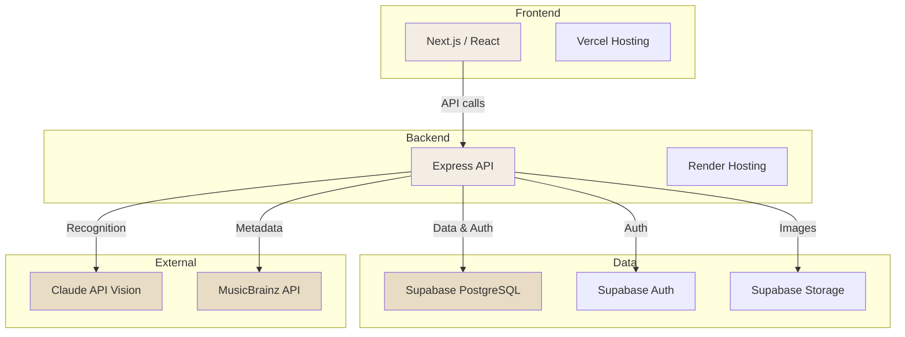
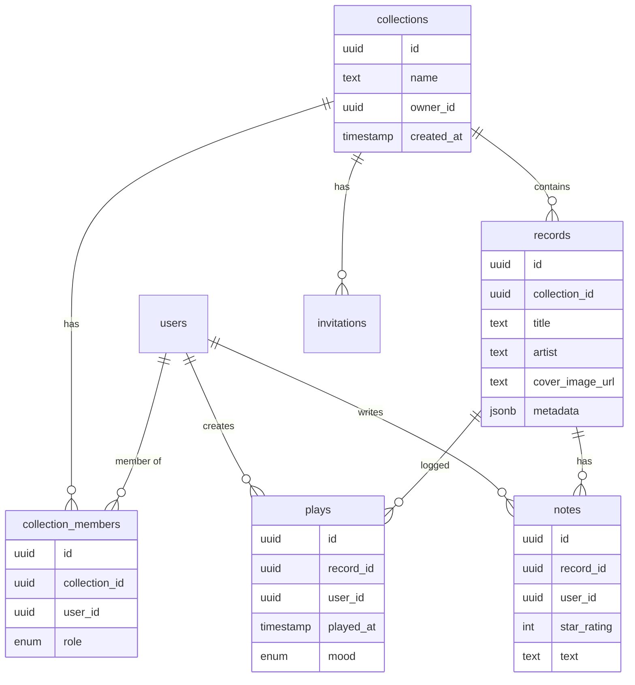

# Side A

A vinyl record collection tracker for music lovers who want to catalog their collection, log listening sessions, and share with friends.

 <!-- TODO: Replace with actual screenshot -->

## Features

### 🎵 Smart Album Recognition
Upload a photo of your album cover or vinyl label, and Side A automatically identifies it using AI vision and MusicBrainz metadata. Get complete track listings, release info, and album art with minimal effort.

### 📊 Play Logging
One-tap play logging captures your listening sessions with timestamps and mood tags (`Morning`, `Cocktail Hour`, `Dinner`, `Late Night`, `Background`, `Weekend`). Build a rich history of what you've been playing and when.

### ⭐ Notes & Ratings
Add personal star ratings (1-5) and notes to any album in your collection. Lightweight and optional — no pressure to fill them in.

### 👥 Shared Collections
Create collections and invite friends or family by email. Everyone sees the same albums and can log their own plays. Perfect for households or shared record libraries.

### 📈 Listening Stats
Track listening habits across your collection:
- Per-user play counts and patterns
- Collection-wide statistics
- Play history with user attribution

### 📱 Progressive Web App
Install Side A to your home screen for a native app experience on mobile devices.

## Tech Stack

Side A is built with modern, free-tier friendly technologies:



**Stack Details:**
- **Frontend:** Next.js (React) hosted on Vercel
- **Backend:** Node.js + Express hosted on Render
- **Database:** PostgreSQL via Supabase with Row Level Security
- **Authentication:** Supabase Auth (email/password + Google OAuth)
- **Image Recognition:** Claude API (vision) + MusicBrainz API
- **File Storage:** Supabase Storage for album covers

## Architecture

### Monorepo Structure
```
side-a/
├── frontend/          # Next.js application
├── backend/           # Express API server
├── supabase/          # Database migrations
└── scripts/           # Build and utility scripts
```

### Data Model



**Security:** All tables use Supabase Row Level Security (RLS) policies to ensure users can only access collections they're members of.

## Getting Started

### Prerequisites
- Node.js 18+ and npm
- A Supabase account (free tier)
- An Anthropic API key for Claude
- Vercel and Render accounts (optional, for deployment)

### Local Development

1. **Clone the repository**
   ```bash
   git clone https://github.com/justinbach/side-a.git
   cd side-a
   ```

2. **Install dependencies**
   ```bash
   npm install
   ```

3. **Set up Supabase**
   - Create a new Supabase project
   - Run migrations from `supabase/migrations/` in order
   - Note your project URL and anon key

4. **Configure environment variables**

   Create `backend/.env`:
   ```env
   SUPABASE_URL=your_supabase_url
   SUPABASE_SERVICE_KEY=your_service_role_key
   CLAUDE_API_KEY=your_anthropic_api_key
   PORT=3001
   ```

   Create `frontend/.env.local`:
   ```env
   NEXT_PUBLIC_SUPABASE_URL=your_supabase_url
   NEXT_PUBLIC_SUPABASE_ANON_KEY=your_anon_key
   NEXT_PUBLIC_API_URL=http://localhost:3001
   ```

5. **Run the development servers**
   ```bash
   # Terminal 1: Backend
   cd backend
   npm run dev

   # Terminal 2: Frontend
   cd frontend
   npm run dev
   ```

6. **Open the app**
   Navigate to `http://localhost:3000`

### Deployment

Side A is designed to run on free tiers:

- **Frontend (Vercel):** Connect your GitHub repo, set root directory to `frontend/`
- **Backend (Render):** Create a Web Service, set root directory to `backend/`, build command `npm install`, start command `npm start`
- **Database (Supabase):** Already hosted, just run migrations

All services auto-deploy on push to `main`.

## Contributing

Contributions are welcome! Please follow these guidelines:

1. Work on short-lived feature branches (`feature/<description>`)
2. Open a PR to `main` when ready
3. Include tests for new features
4. Follow the existing code style

## Design Philosophy

Side A embraces a **mid-century modern / warm minimal** aesthetic:

- **Colors:** Cream, warm whites, muted mustard/burnt orange accents
- **Typography:** Editorial serif headings (Playfair Display) + clean sans-serif body (Inter)
- **Layout:** Generous whitespace, subtle shadows, 6-8px border radius
- **Feel:** Coffee table book meets vintage hi-fi shop

The Play button is the signature interaction — slightly oversized, burnt orange, and satisfying to tap.

## License

MIT License - see LICENSE file for details

## Acknowledgments

- Album metadata via [MusicBrainz](https://musicbrainz.org/)
- AI-powered recognition via [Anthropic Claude](https://www.anthropic.com/claude)
- Built with [Next.js](https://nextjs.org/), [Supabase](https://supabase.com/), and [Vercel](https://vercel.com/)
